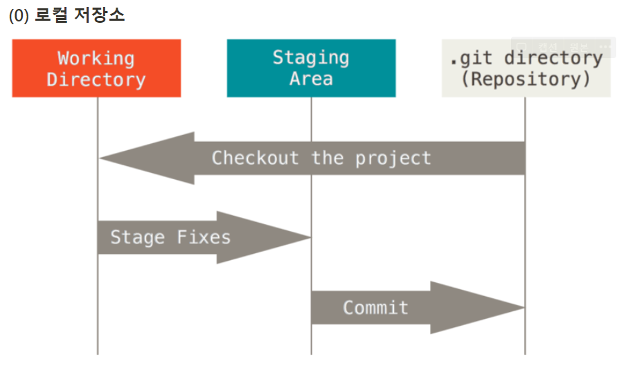
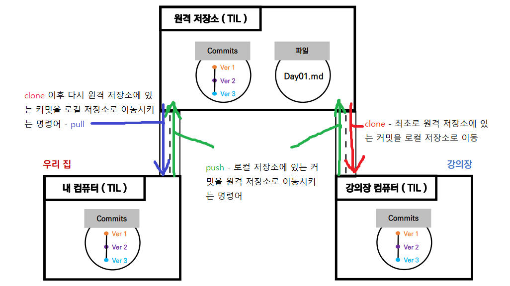

# DAY2

## <복습>

지난 강의에는 VSCode(Visual Studio Code) / git / github 의 개념과 기본적인 사용방법에 대해 배웠다. 

git의 특징은 Working Directory -> Staging Area -> Commits 3단계로 구분되어 버전을 관리한다는 것이다.

- Working Directory (Working Tree) : 사용자의 일반적인 작업이 일어나는곳(ex TIL,Home)
- Staging Area (=index) : 커밋을 위한 파일 및 폴더가 추가되는 곳 (.git 숨김파일형태)
- Repository : staging area에 있던 파일 및 폴더의 변경사항(커밋)을 저장하는 곳

 ### Git 사용 주의 사항

1. 중첩 git init 사용 주의

   - 부모폴더 git이 하위 폴더or파일에 적용됨
   - home폴더에 git 적용 주의

2. git 사용 폴더는 이동, 파일명 변경 가능

   

> 기본적인 사용방법 
>
> - 로컬디렉토리 생성 git init
> - README.md 와 .gitignore 생성(생략가능)
> - vscode에서 명령어 git add / git commit -m "파일명" 으로 git에 버젼관리에 포함
> - 원격 저장소(git hub)에 remote 해서 공유함
>   1. git hub에서 New Repositories 생성하고 주소 복사
>   2. 공유할 로컬 저장소에서 vscode 열어서 git remote add origin [원격 저장소 주소]
>   3. 자료 수정, 추가 해서 업로드할려면 git push -u origin master

___

---

> DAY2 

## < git - clone, pull >

> clone, pull 기본개념

### 1. git clone

- 원격 저장소의 커밋 내역을 모두 가져와서, 로컬 저장소를 생성하는 명령어

- clone은 `"복제"`라는 뜻으로, `git clone` 명령어를 사용하면 원격 저장소를 통째로 복제해서 내 컴퓨터에 옮길 수 있습니다.

- `git clone <원격 저장소 주소>`의 형태로 작성합니다.

  

#### <  clone 사용 방법 >

1. clone 할 커밋이 올 폴더로 이동 한다(home~)
2. `git bash` 실행 `git clone <원격 저장소 주소>`입력

>  clone으로 생성된 폴더는 이름 변경 or 위치 변경 가능

### 2. git pull

- 원격 저장소의 변경 사항을 가져와서, 로컬 저장소를 업데이트하는 명령어

- 로컬 저장소와 원격 저장소의 내용이 완전 일치하면 git pull을 해도 변화가 일어나지 않습니다.

- `git pull <저장소 이름> <브랜치 이름>`의 형태로 작성합니다.

#### <  pull 사용 방법 >

1. 로컬 저장소에서 vscode 실행
2. `git pull origin master`
3. `add` > `commit` > `push`

>  remote(git hub)와 개인 컴퓨터(TIL) 연결상태까지 생성

 #### < Git 사용 주의 사항 >

 중첩 git init 사용 주의

 1. - 부모폴더 git이 하위 폴더or파일에 적용됨
    - home폴더에 git 적용 주의

 2. git 사용 폴더는 이동, 파일명 변경 가능 

    
#### < .gitignore 사용 주의 사항 > 

 1. 이미 한번 git으로 관리하면 (`add,commit`) `gitignore`에서 무시가 안됨.

 2. 기본적으로  project 시작 방법
    -  Local 저장소 만들고(ex project폴더) 
    - `README`, `.gitignore` 만들기
    - `git init` 하기

#### < git hub profile 생성 방법>

- `git init` > `git add` > `git commit -m "Upload github pages"` > `git remote add origin 주소` > `git remote -v` > `git push -u origin master` > `원격 저장소 -> settings -> pages` > vscode 가서 `.nojekyll`만들고 `add commit push` > `git add` . >

  `git commit -m "Upload nojekyll"` > `git push`
