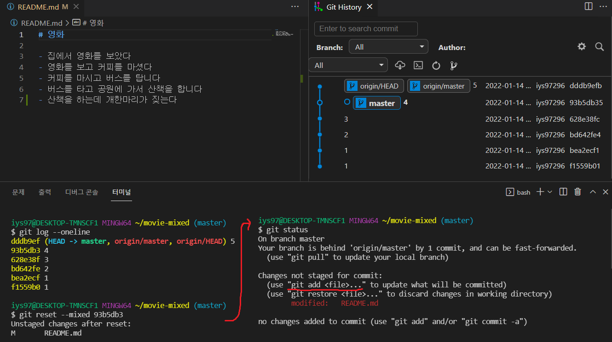
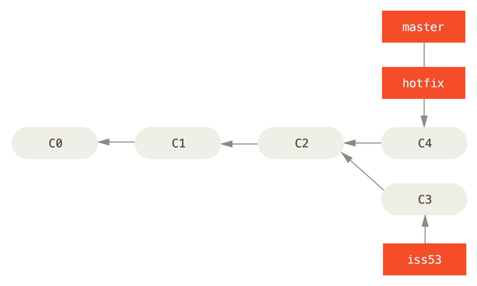
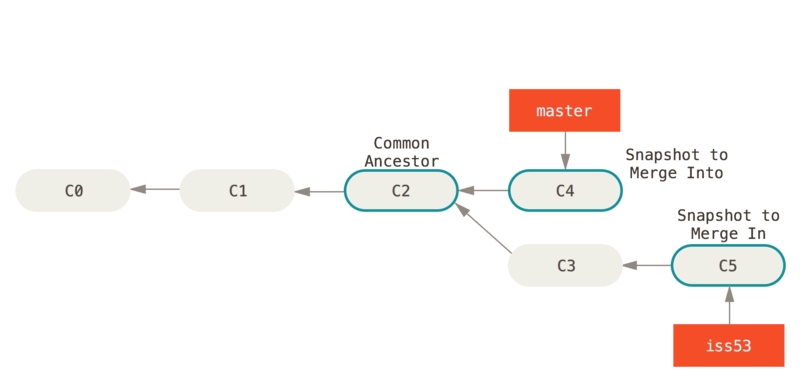

# DAY3

#### # 만약 TIL-home에서 pull이 아니라 commit을 먼저한 후 pull을 하면 어떻게 될까?

다음 세 가지의 경우가 있을 수 있습니다. 

1. 내 컴퓨터와 강의장 컴퓨터에서 서로 다른 파일을 수정한 경우 → 정상적으로 git pull이 됩니다. 
2. 내 컴퓨터와 강의장 컴퓨터에서 같은 파일을 수정했지만, 수정한 라인이 다른 경우 → 정상적으로 git pull이 됩니다. 
3. 내 컴퓨터와 강의장 컴퓨터에서 같은 파일의 같은 라인을 수정한 경우 → 충돌(conflict)이 발생합니다. 어느 내용을 반영할지 직접 선택해야 합니다.


#### 

conflict 발생 후 

VIM 편집기

`i` : 입력모드

`ece` + `:wq `= 탈출/종료

#### #만약 TIL-home에서 pull이 아니라 commit을 먼저한 후 바로 push 하면 어떻게 될까요? 아래와 같은 에러 메시지가 나타나면서 push가 실패합니다.

```
To https://github.com/edukyle/TIL-remote.git

! [rejected]     master -> master (non-fast-forward)

error: failed to push some refs to 'https://github.com/giraffe69/TIL-remote.git'
```

- 원격 저장소의 내용을 먼저 받아오지 않고, 로컬 저장소에서 새로운 커밋을 생성했기 때문에 서로의 커밋 내역이 달라져서 그렇습니다.

- 만약 로컬 저장소와 원격 저장소의 내용이 다르다면 일단 git pull을 통해 동기화를 시키고 새로운 커밋을 쌓아 나가야 합니다.


##  1. git reset

> 가끔 앱을 사용하다가 업데이트를 했는데, 오히려 예전 버전이 더 좋다고 느낄 때가 있습니다. 이처럼 만약 여러분들이 예전 버전으로 돌아가고 싶을 땐 어떻게 해야할까요?

- `git reset [옵션] <커밋 ID>`의 형태로 사용합니다.

- **시계를 마치 과거로 돌리는 듯한 행위(타임머신)**로써, 특정 커밋 상태로 되돌아갑니다.

- 특정 커밋으로 되돌아 갔을 때, 해당 커밋 이후로 쌓아 놨던 커밋들은 전부 사라집니다.

- `옵션`은 아래와 같이 세 종류가 있으며, 생략 시 `--mixed`가 기본 값입니다.

  1. ```
     --soft
     ```

     - **돌아가려는 커밋으로 되돌아가고**,
     
     - 이후의 commit된 파일들을 `staging area`로 돌려놓음 (commit 하기 전 상태)

     - 즉, 다시 커밋할 수 있는 상태가 됨
     
     - 예시
     
       
     
  2. ```
     --mixed
     ```
  
     - **돌아가려는 커밋으로 되돌아가고**,
     - 이후의 commit된 파일들을 `working directory`로 돌려놓음 (add 하기 전 상태)
     - 즉, unstage 된 상태로 남아있음
     - 기본 값
     - 예시
     
  3. ```
     --hard
     ```
  
     - **돌아가려는 커밋으로 되돌아가고**,
  
     - 이후의 commit된 파일들(`tracked 파일들`)은 모두 working directory에서 삭제
  
     - 단, Untracked 파일은 Untracked로 남음
  
     - 혹시나 이미 삭제한 커밋으로 다시 돌아가고 싶다면? → `git reflog`를 사용합니다.
  
       ```bash
       $ git reflog
       1a410ef HEAD@{0}: reset: moving to 1a410ef
       ab1afef HEAD@{1}: commit: modified repo.rb a bit
       484a592 HEAD@{2}: commit: added repo.rb
       
       git reflog 명령어는 HEAD가 이전에 가리켰던 모든 커밋을 보여줍니다.
       따라서 --hard 옵션을 통해 지워진 커밋도, reflog로 조회하여 돌아갈 수 있습니다.
       ```
  
     - 예시
  
     - `git reset --hard`를 통해 삭제된 커밋을 복구하고 싶을때는 어떻게 해야 할까요? `git reflog`를 사용하면 쌓인 모든 커밋 내역을 보여줍니다. __즉 Git은 삭제라는 개념이 없습니다. 삭제한다는 행위 자체도 모두 저장됩니다.__


- ```bash
$ git reflog
  ```
  
  이후 돌아가고 싶은 커밋 ID에 대해 `git reset --hard` 를 진행합니다.

- 그림으로 이해하는 `git reset`

  

  이전 커밋으로 돌아가고, 돌아간 커밋 이후의 내역은 사라집니다.

## 2. git revert

> git reset은 쉽게 과거로 돌아갈 수 있다는 장점이 있지만, 커밋 내역이 사라진다는 단점이 있습니다. 따라서 다른 사람과 협업할 때 커밋 내역의 차이로 인해 충돌이 발생할 수 있습니다.

- `git revert <커밋 아이디>` 의 형태로 사용합니다.

- **특정 사건을 없었던 일로 만드는 행위**로써, `이전 커밋을 취소한다는 새로운 커밋`을 만듭니다.

- git reset은 커밋 내역을 삭제하는 반면, git revert는 `새로 커밋을 쌓는다`는 차이가 있습니다.

- 사용

  ```bash
  $ git log --oneline
  7f6c24c (HEAD -> master) foo & bar
  006dc87 rename commit message
  3551584 asdasd
  71ccbf1 first
  
  # revert commit 편집기 실행
  $ git revert 71ccbf1
  Removing foo.txt
  Removing bar.txt
  [master 3b55051] Revert "first"
   2 files changed, 0 insertions(+), 0 deletions(-)
   delete mode 100644 bar.txt
   delete mode 100644 foo.txt
  
  $ git log --oneline
  3b55051 (HEAD -> master) Revert "foo & bar" # 새로 쌓인 커밋
  7f6c24c foo & bar # 히스토리는 남아있음
  006dc87 rename commit message
  3551584 asdasd
  71ccbf1 first
  ```

- 기타

  ```bash
  # 공백을 통해 여러 커밋을 한꺼번에 되돌리기 가능
  $ git revert 7f6c24c 006dc87 3551584
  
  # 범위 지정을 통해 여러 커밋을 한꺼번에 되돌리기 가능
  $ git revert 3551584..7f6c24c
  
  # 커밋 메시지 작성을 위한 편집기를 열지 않음 (자동으로 커밋 완료)
  $ git revert --no-edit 7f6c24c
  
  # 자동으로 커밋하지 않고, Staging Area에만 올림 (이후, git commit으로 수동 커밋)
  # 이 옵션은 여러 커밋을 revert 할 때 하나의 커밋으로 묶는게 가능
  $ git revert --no-commit 7f6c24c
  ```

<aside> ❗ **git reset과 비슷하다는 이유로 다음 사항이 혼동될 수 있습니다.**

`git reset --hard 5sd2f42`라고 작성하면 5sd2f42라는 커밋`으로` 돌아간다는 뜻입니다. `git revert 5sd2f42`라고 작성하면 5sd2f42라는 커밋`을` 되돌린다는 뜻입니다.

</aside>

- 그림으로 이해하는 `git revert`

  

  이전 커밋을 취소했다는 새로운 커밋을 생성합니다. (이전 커밋은 그대로 살아있습니다.)


------


## 3. Branch 

> Git에서 Branch라는 개념은 매우 중요합니다. 사실상 버전 관리의 꽃이라고 할 수 있습니다.

### 2. Branch란?

### 

- Branch는 `나뭇가지`라는 뜻의 영어 단어입니다.
- 즉 `브랜치`란 나뭇가지처럼 여러 갈래로 작업 공간을 나누어 **독립적으로 작업**할 수 있도록 도와주는 Git의 도구입니다.
- 장점
  1. 브랜치는 독립 공간을 형성하기 때문에 원본(master)에 대해 안전합니다.
  2. 하나의 작업은 하나의 브랜치로 나누어 진행되므로 체계적인 개발이 가능합니다.
  3. 특히나 Git은 브랜치를 만드는 속도가 굉장히 빠르고, 용량도 적게 듭니다.
- 그래도 브랜치 꼭 써야하나요?
  1. 일단 master 브랜치는 상용을 의미합니다. 그래서 언제든 세상에 공개되어 있습니다.
  2. 만약 상용에 에러가 있어서 고쳐야 한다면 어떻게 해야할까요?
  3. 고객들이 사용하고 있는데, 함부로 버전을 되돌리거나 삭제할 수 있을까요?
  4. 따라서 브랜치를 통해 별도의 작업 공간을 만들고, 그곳에서 되돌리거나 삭제를 합니다.
  5. 브랜치는 완전하게 독립이 되어있어서 어떤 작업을 해도 master에는 영향을 끼치지 못하죠.
  6. 그리고 이후에 에러를 해결했다면? 그 내용을 master에 반영할 수도 있습니다!
  7. 이러한 이유 때문에 Git에서 브랜치는 정말 강력한 기능 중의 하나라고 할 수 있습니다.

### 2. git branch

> 브랜치 `조회, 생성, 삭제 등` 브랜치와 관련된 Git 명령어

```bash
# 브랜치 목록 확인
$ git branch

# 원격 저장소의 브랜치 목록 확인
$ git branch -r

# 새로운 브랜치 생성
$ git branch <브랜치 이름>

# 특정 커밋 기준으로 브랜치 생성
$ git branch <브랜치 이름> <커밋 ID>

# 특정 브랜치 삭제
$ git branch -d <브랜치 이름> # 병합된 브랜치만 삭제 가능
$ git branch -D <브랜치 이름> # (주의) 강제 삭제 (병합되지 않은 브랜치도 삭제 가능)
```

### 3. git switch

> 현재 브랜치에서 다른 브랜치로 `HEAD`를 이동시키는 명령어 `HEAD`란 현재 브랜치를 가리키는 포인터를 의미합니다.

```bash
# 다른 브랜치로 이동
$ git switch <다른 브랜치 이름>

# 브랜치를 새로 생성과 동시에 이동
$ git switch -c <브랜치 이름>

# 특정 커밋 기준으로 브랜치 생성과 동시에 이동
$ git switch -c <브랜치 이름> <커밋 ID>
```


**git switch 하기 전에, 워킹 디렉토리 파일이 모두 버전 관리가 되고 있나요?**

master 브랜치와 feature 브랜치가 있다고 가정해보겠습니다. feature 브랜치에서 test.txt를 만들고 git add 하지 않은 상태에서 `git switch master`를 하면 어떤 일이 발생할까요? 바로 feature 브랜치에서 만들었던 test.txt가 master 브랜치에도 똑같이 생성됩니다.

**왜 그럴까요?** Git의 브랜치는 독립적인 작업 공간을 가지지만, 어디까지나 Git이 관리하는 파일 트리에 한해서 입니다. git add를 하지 않은, 즉 Staging Area에 한 번도 올라가지 않은 새 파일은 Git의 버전 관리를 받고 있지 않기 때문에 브랜치가 바뀌더라도 계속 유지되는 것입니다.

따라서 반드시 git switch를 하기 전에는 모든 워킹 디렉토리의 파일이 버전 관리가 되고 있는지 확인해야 합니다.

</aside>


## 4. Branch Merge

> 지금까지는 브랜치를 통해서 독립된 작업 공간을 만드는 것 까지 진행했습니다. 이제 각 브랜치에서의 작업이 끝나면 어떻게 할까요? 그 작업 내용을 master에 반영해야 하지 않을까요? 지금부터는 `Merge`라고 하는 `병합`을 학습하면서 브랜치를 합치는 것을 살펴보겠습니다.

### 1. git merge

- 분기된 브랜치들을 하나로 합치는 명령어

- `git merge <합칠 브랜치 이름>`의 형태로 사용합니다.

- **Merge하기 전에 일단 다른 브랜치를 합치려고 하는, 즉 메인 브랜치로 switch 해야합니다.**

  ```bash
  # 1. 현재 branch1과 branch2가 있고, HEAD가 가리키는 곳은 branch1 입니다.
  $ git branch
  * branch1
    branch2
  
  # 2. branch2를 branch1에 합치려면?
  $ git merge branch2
  
  # 3. branch1을 branch2에 합치려면?
  $ git switch branch2
  $ git merge branch1
  ```

### 2. Merge의 세 종류

##### [1]**Fast-Forward**

- 브랜치를 병합할 때 마치 `빨리감기`처럼 브랜치가 가리키는 커밋을 앞으로 이동시키는 것

1. 현재 master는 C2 커밋을, hotfix는 C4 커밋을 가리키고 있습니다.

   

2. master에 hotfix를 병합하면 어떻게 될까요?

   ```bash
   $ git switch master
   $ git merge hotfix
   Updating s1d5f1s..1325sd4
   **Fast-forward**
    index.html | 2 ++
    1 file changed, 2 insertions(+)
   ```

3. hotfix가 가리키는 C4는 C2에 기반한 커밋이므로, master가 C4에 이동하게 됩니다.

   이렇게 따로 merge 과정 없이 브랜치의 포인터가 이동하는 것을 `Fast-Forward`라고 합니다.

   

4. 병합이 완료된 hotfix는 더 이상 필요 없으므로 삭제합니다.

   ```bash
   $ git branch -d hotfix
   Deleted branch hotfix (1325sd4).
   ```

**[2] 3-Way Merge**

- 브랜치를 병합할 때 `각 브랜치의 커밋 두개와 공통 조상 하나`를 사용하여 병합하는 것
- 두 브랜치에서 `다른 파일` 혹은 `같은 파일의 다른 부분`을 수정했을 때 가능합니다.

1. 현재 master는 C4 커밋을, iss53은 C5 커밋을 가리키고 있습니다.

   master와 iss53의 공통 조상은 C2 커밋입니다.

   

   이 상황에서 master에 iss53을 병합하면 어떻게 될까요?

   ```bash
   $ git switch master
   Switched to branch 'master'
   $ git merge iss53
   **Merge made by the 'ort' strategy.**
   index.html |    1 +
   1 file changed, 1 insertion(+)
   ```

3. master와 iss53은 갈래가 나누어져 있기 때문에 Fast-Forward로 합쳐질 수 없습니다.

   따라서 공통 조상인 C2와 각자가 가리키는 커밋인 C4, C5를 비교하여 3-way merge를 진행합니다.

   

4. 이때 생긴 C6는 master와 iss53이 병합되면서 발생한 Merge Commit입니다.

5. 병합이 완료된 iss53은 더 이상 필요 없으므로 삭제합니다.

   ```bash
   $ git branch -d iss53
   Deleted branch iss53 (58sdf23).
   ```

**[3] Merge Conflict**

- 병합하는 두 브랜치에서 `같은 파일의 같은 부분`을 수정한 경우, Git이 어느 브랜치의 내용으로 작성해야 하는지 판단하지 못해서 발생하는 충돌(Conflict) 현상
- 결국은 사용자가 직접 내용을 선택해서 Conflict를 해결해야 합니다.

1. 현재 master는 C4 커밋을, iss53은 C5 커밋을 가리키고 있습니다.

   master와 iss53의 공통 조상은 C2 커밋입니다. `(3-way merge에서 상황과 같습니다)`

   

2. 3-way merge와는 달리, 만약 master와 iss53이 `같은 파일의 같은 부분`을 수정하고 병합한다면 어떤 일이 발생할까요?

   ```bash
   $ git merge iss53
   Auto-merging index.html
   CONFLICT (content): Merge conflict in index.html
   Automatic merge failed; fix conflicts and then commit the result.
   ```

3. 충돌이 일어난 파일을 확인하기 위해 `git status`를 입력합니다.

   ```bash
   $ git status
   On branch master
   You have unmerged paths.
     (fix conflicts and run "git commit")
   
   Unmerged paths:
     (use "git add <file>..." to mark resolution)
   
       both modified:      index.html
   
   no changes added to commit (use "git add" and/or "git commit -a")
   ```

4. `index.html`을 열어보면 아래와 같이 충돌 내역이 나옵니다.

   ```html
   <<<<<<< HEAD:index.html
   <div id="footer">contact : email.support@github.com</div>
   =======
   <div id="footer">
    please contact us at support@github.com
   </div>
   >>>>>>> iss53:index.html
   ```

5. `=======` 를 기준으로 위는 master의 내용, 아래는 iss53의 내용입니다.

   이 중 하나를 선택할 수도 있고, 둘 다 선택할 수도 있고, 아예 새롭게 작성할 수도 있습니다.

   ```html
   <div id="footer">
   please contact us at email.support@github.com
   </div>
   ```

6. 이후 git add와 git commit을 통해 병합한 내용을 커밋할 수 있습니다.

   ```bash
   $ git add .
   $ git commit
   ```

7. Vim 편집기를 이용해서 커밋 내역을 수정할 수 있습니다.

   ```bash
   Merge branch 'iss53'
   
   Conflicts:
       index.html
   #
   # It looks like you may be committing a merge.
   # If this is not correct, please remove the file
   #	.git/MERGE_HEAD
   # and try again.
   
   # Please enter the commit message for your changes. Lines starting
   # with '#' will be ignored, and an empty message aborts the commit.
   # On branch master
   # All conflicts fixed but you are still merging.
   #
   # Changes to be committed:
   #	modified:   index.html
   #
   ```

8. Vim 편집기를 통해 작성한 커밋이 이제 C6 커밋이 됩니다.

   

9. 병합이 완료된 iss53은 더 이상 필요 없으므로 삭제합니다.

   ```bash
   $ git branch -d iss53
   Deleted branch iss53 (58sdf23).
   ```
