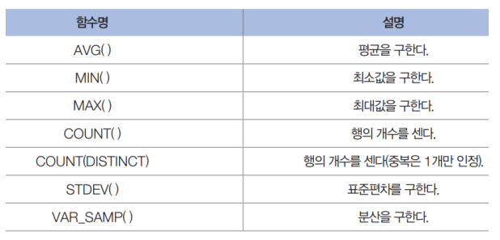

### 데이터베이스

---

##### [1] 데이터베이스(DB:DataBase= 스키마)


데이터베이스(DB: database)는 통합하여 관리되는 데이터의 집합체를 의미합니다. 

이는 중복된 데이터를 없애고, 자료를 구조화하여, 효율적인 처리를 할 수 있도록 관리됩니다.

따라서, 여러 업무에 여러 사용자가 데이터 베이스를 사용할 수 있습니다.

이러한 데이터베이스는 응용 프로그램과는 다른 별도의 미들웨어에 의해 관리됩니다.

데이터베이스를 관리하는 이러한 미들웨어를 데이터베이스 관리 시스템(DBMS: Database Management System)이라고 합니다.

---


##### [2] 데이터베이스의 특징


1. **데이터의 무결성** 

데이터베이스에 저장된 데이터 값과 그것이 표현하는 현실 세계의 실제값이 일치하는 정확성을 의미한다. 그래서 제약조건을 가진다.

2. **데이터의 독립성**

하위 단계의 데이터 구조가 변경되더라도 상위 단계에 영향을 미치지 않는 속성이다. 응용프로그램과 데이터베이스는 독립되어 있으므로, 데이터의 논리적 구조와 응용프로그램은 별개로 동작됩니다.

3. **보안** 

데이터베이스 안의 데이터는 아무나 접근할 수 있는 것이 아니며, 접근할 떄 사용자의 계정의 따라서 다른 권한을 가져야 한다. 즉, 외부 유출로 부터 안전해야 한다.

4. **데이터 중복의 최소화** 

같은 데이터가 중복되어 저장되는 것을 방지한다.

5. **응용 프로그램 제작 및 수정이 쉬어짐**

통일된 방법으로 응용프로그램을 지원함으로, 통일된 방식으로 작성할 수 있으며, 유지 보수도 쉽게 할 수 있다. 

6. **데이터의 안전성 향상**

DBMS가 제공하는 백업/복원 기능을 이용하면 데이터가 꺠지는 문제가 발생할 때 원상 복우너 또는 복구하는 방법이 명확해진다.

---


### 관계형 데이터베이스

---

#### 관계형 데이터베이스(relational database)란?

관계형 데이터베이스는 현재 가장 많이 사용되고 있는 데이터베이스의 한 종류입니다.

관계형 데이터베이스란 테이블(table)로 이루어져 있으며, 이 테이블은 키(key)와 값(value)의 관계를 나타냅니다.

이처럼 데이터의 종속성을 관계(relationship)로 표현하는 것이 관계형 데이터베이스의 특징입니다.

 

관계형 데이터베이스의 테이블(table)은 다음 그림처럼 구성됩니다.


#### <SELECT문>

---

**기본구조**

```
SELECT 컬럼명1,컬러명2,... From 테이블명 WHERE 조건; 
```

Select문 : 조건에 맞는 데이터. 조건문에 중첩가능.

> 컬럼 : 데이터를 선택할 테이블의 필드 이름
>
> 컬럼 별칭에 공백 및 특수문자가 포함될 때는 "" 필수.
>
> 주석달때는 **"--"** 이나  **"/*"** + **"*/"** 를 사용하면 된다.

---

```
   SELECT * FROM table WHERE id = 'user';
```

: table 테이블에서 id가 user의 컴럼 데이터를 모두 가져온다.

```
SELECT *|[DISTINCT] 컬럼명 [AS]["] 컬럼별칭 ["],
```

> '[DISTINCT]' : 중복도니 자료를 제외시킨 결과

```
SELECT [PREDICATE] [테이블명] 속성명 [AS별칭]
```

> SELECT 절에 '*'를 사용하면 해당 테이블에 있는 모든 컬럼 전체를 결과를 출력

```
FROM 테이블명 [테이블별칭],[.....]
```

```
[WHERE 조건 [AND | OR 조건]....]
```

> WHERE 절이 생략되면 해당 테이블의 모든 행이 결과로 출력

```
[GROUP BY 컬럼명[,컬럼명, ...]
```

```
[HAVING 조건]
```

```
[ORDER BY 컬럼명|컬럼INDEX [ASC+DESC...]], ...];
```

> '컬럼인덱스'는 SELECT절에 사용된 컬럼의 순번(1부터 사용)
>
> '[ASC|DESC]' 정렬방법, ASC는 오름차순이고 DESC는 내림차순. default는 ASC

#### <WHERE 절>

1. 기본형태

```
SELECT * FROM usertbl where 컬럼명1 = 'a';
SELECT 컬럼명1, 컬럼명2 FROM 테이블명 WHERE 
```
```
조건연산자 : = , < , > , <= , >= , != 등
관계연산자 : NOT, AND, OR 등
```
2. 서브퀴리형

```
SELECT 컬럼명1, 컬럼명2 FROM 테이블명1 
WHERE 컬럼명2 > (SELECT 컬럼명2 FROM 테이블명1 WHERE 컬럼명1 = '로우1');
```

> 컬럼명1의 데이터 로우1의 값을 조건 연산자를 통해 WHERE 절 조건을 만든다.

3.  BETWEEN A AND B 

```
SELECT 컬럼명1, 컬럼명2 FROM 테이블명
WHERE 컬럼명2 BETWEEN A AND B;
```

4. AND(IN)  / ALL(SOME) 

```
ANY(IN) / ALL(SOME)그리고 서브쿼리
SELECT 컬럼명1, 컬럼명2 FROM 테이블명
WHERE 컬럼명2 >= ALL SELECT 컬럼명2 FROM 테이블명
```

---

#### <WHERE 뒤에 오는 것들 >

1. ORDER BY

```
ORDER BY (원하는 순서대로 정렬하여 출력)
SELECT 컬럼명1, 컬럼명2 FROM 테이블명 ORDER BY 컬럼명2 DESC;
SELECT 컬럼명1, 컬럼명2 FROM 테이블명 ORDER BY 컬럼명2 DESC, 컬럼명1 ASC;
```

> DESC : 기본(내림차순)  /  ASC(오름차순) 
>
> ORDER BY 절은 코드 맨 마지막에 와야 된다.


2. DISTINT 

:중복된 것들에 대한 제거

```
SELECT DISTINCT 컬럼명 FROM 테이블명;
```


3. LIMIT N 

:출력하는 개수를 제한

```
SELECT 컬럼명1, 컬럼명2 FROM 테이블명 ORDER BY 컬럼명2 ASC
LIMIT 0,5; 
```

> LIMIT 0,5 = LIMIT 5 IFFSET 0 과 동일하다.


#### <CREATE TABLE ... SELECT 구문> 

: 테이블을 복사해서 사용

```
CREATE TABLE 새로운 테이블 (SELECT 복사할 열 FROM 기존테이블); 
                         (SELECT * FROM 기존테이블);
```

---

#### <GROUP BY 및 HAVING 그리고 집계 함수>

```
SELECT 컬럼명1 AS '명칭1', SUM(컬럼명2)AS '명칭2' 
	FROM 테이블명 GROUP BY 컬럼명1;
```

```
SELECT 컬럼명1 AS '명칭1', SUM(price*amount) As '명칭2'
	FROM 테이블명 GROUP BY 컬럼명1;
```


- 집계함수 종류



---

